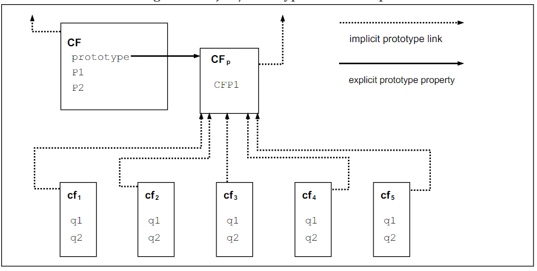

《从规范看ECMAScript》是笔者将要写的一系列文章+笔记，目的是从规范底层来看ECMAScript的各种行为（特色or异常）。

参考的规范是ECMASCript2018即ES9，地址[🔗](https://www.ecma-international.org/ecma-262/9.0/index.html)。

因为ES9是ES正式的最新版本，于2018年六月发布。而ECMAScript2019[🔗](https://tc39.github.io/ecma262/)目前的状态还是draft（大概19.6转为正式）。虽然变动不会太大，还是以稳定的版本为准吧。

ES历史版本地址[🔗](https://www.ecma-international.org/publications/standards/Ecma-262-arch.htm)，ES最新发布版本地址[🔗](https://www.ecma-international.org/publications/standards/Ecma-262.htm)。

本文还参考了[zhoushengmufc](https://github.com/zhoushengmufc/es6)的中文版本[ES6](http://zhoushengfe.com/es6/es6-ch.html#)（此中文版本未译全）。在这里，笔者还要推荐一个Github的项目：engine262[🔗](https://github.com/devsnek/engine262)。此项目按照规范实现了一个标准的ES的解释器。（是真的标准，基本完全符合规范里的算法步骤，调试调试对理解规范的运行时语义更有帮助。）

笔者的文章主要是对ES**运行时语义**的分析，所以关于其静态语义讲的不多。

如果你想完整的阅读规范，阅读之前可以先看看一个[大神](https://github.com/TimothyGu)写的[如何阅读ES](https://timothygu.me/es-howto)，上面提到的engine262也有他的参与。

-------------------------------

本文主要介绍规范1~5章，是对ES的总览和规范里的记法约定。

# 介绍

ES1th发布于1997年6月，ES2th发布于1998年6月，主要是对第一版的格式修正。

ES3th引入了正则表达式，更好的字符串处理，新的控制语句，`try/catch`异常处理，更严格的错误定义，数字输出的格式。发布于1999年12月。

ES3之后ES被万维网所采用，被大部分浏览器所支持。但是由于关于语言的复杂性出现分歧，ES4th没有完成。

ES5th增加了一些特性，例如严格模式、访问器属性、JSON的支持等，发布于2009年12月。ES5.1对ES5进行了微小的修改，发布于2011年6月。

ES6th发布于2015年6月，实际上ES6的集中发展在2009年，并且在1999年出版第三版之前，就进行了大量的实验和语言增强设计工作，可以说ES6是十五年努力的结果。发展目标包括更好地支持大型应用程序、库创建以及将ECMAScript用作其他语言的编译目标。

其主要改进为：模块、类声明、词法作用域、迭代器和生成器、`promise`异步编程、结构模式、尾调用。扩展了ECMAScript内置库，以支持额外的数据抽象，包括`map`、`set`、二进制数值数组，以及对字符串和正则表达式中Unicode补充字符的额外支持。

ES7th添加了指数运算、`Array.prototype.includes`。另外从ES7开始ES发布就是一年一更了（我根据规律猜的😂）。

ES8th引入了`Async`、共享内存、`Atomics` 、库增强、Bug修复。

`async`函数提供了`promise-returning `函数，增强了异步编程体验。

共享内存和`Atomics`引入了一种新的内存模型，允许多代理程序使用原子操作进行通信，即使在并行处理器上也能确保定义良好的执行顺序。（暂时不太懂）

还增加了`Object.values`, `Object.entries`, 和 `Object.getOwnPropertyDescriptors`。

本规范（ES9th）通过异步迭代器协议和异步生成器引入对异步迭代的支持。还引入了四个新的正则表达式特色，还有对象属性的rest参数和扩展运算符支持。

# 概述

ECMAScript是一种**面向对象**的编程语言，用于在宿主环境中执行计算和操作计算对象。

ECMAScript最初被设计成一种Web脚本语言，提供了一种机制来使浏览器中的网页更加有趣，并作为基于Web的客户端-服务器体系结构的一部分来执行服务器计算。

ECMAScript现在用于为各种**宿主环境**提供核心脚本功能。

-------------------------

这一节有用的就这些，其中宿主环境指浏览器或者Node环境等。

## Web Scripting

*浏览器端*

Web浏览器为客户端计算提供了ECMAScript宿主环境，例如：窗口对象、菜单、弹出窗口、对话框、文本区域、链接、框架、浏览历史、cookie、和输入/输出。

此外，主机环境提供了一种将脚本代码附加到事件的方法，例如：焦点改变、鼠标动作等等事件。脚本代码对用户交互起反应，不需要主程序。

在浏览器端ES主要为了处理用户与浏览器之间的交互。

*服务端*

Web服务器为了服务器端计算提供了一个不同的宿主环境，包括请求、文件IO等等。


每个支持ECMAScript的Web浏览器和服务器都提供自己的宿主环境，以完成ECMAScript执行环境。


## ECMAScript总览

ES是**基于对象**的，基本语言和宿主工具都是由对象提供，ES程序是一组**通信对象**。

对象是一系列**属性`property `**的集合。每个属性的**特性`attribute`**决定了属性行为。例如其`writable` 决定其是否可写，`configurable`决定其是否可配置，等等。

属性是一个容纳其他对象、原始值、函数的容器。

**原始值**（primitive value）有六种类型：**Undefined**、**Null**、 **Boolean**、**Number**、**String**、**Symbol**。

**函数**（function）是可调用（callable）对象。通过属性与对象关联的函数称为**方法**（method）。

ECMAScript定义了一组**内置对象**，这些对象完善了ECMAScript实体的定义。

这些内置对象有

全局（Global）对象；

维持语言运行时语义的基础的对象： `Object`、 `Function`、`Boolean`、`Symbol`和各种`Error`对象；

表示和操控数值的对象：`Math`、`Number`、和`Date`；

用于处理文字对象：`String` 和 `RegExp`；

值的索引集合的对象：`Array`，和九种类型的数组，其元素都具有特定的数值数据表示形式；

键的集合的对象：`Map`、`Set`；

结构化数据的对象：`JSON`、`ArrayBuffer`、`SharedArrayBuffer` 和 `DataView`；

控制抽象的对象：生成器函数、`Promise`；

反射对象：`Proxy`、`Reflect`。

ECMAScript定义了一系列内置操作符：* / + - >> 等等。

大型ES程序支持**模块（Module）化**，允许程序被分成多个语句和声明序列。 每个模块显式地标识它使用的需要由其他模块提供的声明，以及它的哪些声明可供其他模块使用。

----------------

这节大概讲了下ES的类型，内置对象。关于其类型，在第六章会详细讲述。

### 对象

ES 对象并不是完全基于类的。 可以通过各种方法，例如字面量定义或构造器（constructor）来创建对象，并对其分配属性。

每个构造器都是一个函数，都有一个**原型**属性，用来实现**基于原型的继承和属性共享**。

构造器创建的对象有一个被称作对象原型的隐式引用, 指向构造器的`prototype`属性。

原型可以具有对其原型的非空隐式引用，这就是**原型链**。

> 当引用对象中的属性时，该引用指的是原型链中包含该名称的属性的第一个对象中该名称的属性。首先检查直接对象的这种属性; 如果该对象包含命名属性，则引用该属性; 如果该对象不包含命名属性，则接下来检查该对象的原型。



（上面这张图大家应该看得懂，我就不解释了。看不懂的话本文可能不适合你，再了解了解JS再来看吧。）

> 在基于类的面向对象语言中，通常状态由实例承载，方法由类承载，继承仅具有结构和行为。 在ECMAScript中，状态和方法由对象承载，而结构，行为和状态都是继承的。

###  严格模式

ES还提供了严格模式，严格变体排除了常规ECMAScript语言的某些特定句法和语义特征，并修改了某些特征的详细语义。

略述，详细内容[🔗](https://www.ecma-international.org/ecma-262/9.0/index.html#sec-strict-variant-of-ecmascript)

## 术语和定义

这小节定义了许多术语，例如类型、原型、原始值、构造器等，还有`string`、`number`这些值的范围等等，详细内容[🔗](https://www.ecma-international.org/ecma-262/9.0/index.html#sec-terms-and-definitions)。

讲几个不好理解的术语，对象的四种类型：

- `ordinary object`**普通对象**：对象具有所有对象支持的基本内部方法。
- `exotic object`**怪异对象**：没有一个或多个基本内部默认方法的对象。(任何不是普通对象的对象都是非普通对象。)
- `standard object`**标准对象**：其语义由本规范定义。标准对象可以是普通对象，也可以是怪异对象。
- `built-in object`**内置对象**：按照ECMAScript实现的对象。标准内置对象在本规范中定义。 ECMAScript实现（例如JS、Node）可以指定和提供附加种类的内置对象。 *内置构造函数*是一个内置对象，也是一个构造函数。所有的标准对象都是内置对象。

举例说明一下：

```js
// 普通对象就是普通对象喽
let ordinary_obj = {
  a: 'test',
  b: 1
}
// 怪异对象就是非普通对象，例如函数的参数args、数组对象、字符串对象等
let standard_object = new String('lalala')
// 标准对象就是本规范定义的例如
let standard_obj = new Array()
// 内置对象就是宿主环境内置的对象例如
let built_in_obj = console
```

这些不太重要，就不细说了（因为我也不太懂😂）

##  本规范章节组织

第五章：规范的记法约定。

第六-九章：定义了ES程序运行的执行环境。

第十-十六章：定义了实际的ES程序语言，包括句法编码、运行时语义等。

第十七-二十六章：定义了ES标准库，包括ES程序执行时可用的所有标准对象。

第二十七章：描述了`SharedArrayBuffer`支持的内存访问的内存一致性模型以及`Atomics`对象的方法。

# 记法约定

这章主要是一些编译原理的知识。不做过多探讨，有兴趣可以看[🔗](http://zhoushengfe.com/es6/es6-ch.html#sec-notational-conventions)。

## 语法和词法

### 上下文无关法

**上下文无关文法**由多个**产生式**(production)组成.每个产生式具有作为其左侧的**非终结符号**以及右侧零个或多个非终结符号和**终结符**，对于每个语法，终端符号从指定的字母表中绘制。

**链产生式**(chain production)是在其右侧具有一个非终端符号以及零个或多个终端符号的产生式。

从由单个区分的非终止符（称为*目标符号*）组成的句子开始，给定的上下文无关语法规定了语言，即可能的 可以由右侧序列中的任何非终端,重复替换非终止符是左侧的终端符号的序列。

来举个:chestnut:：

*ArrayLiteral:*
​	[*Elision*]

​	[*ElementList*]

​	[*ElementList*, *Elision*]
*ElementList:*
​	*Elision* *AssignmentExpression*

​	*Elision* *SpreadElement*

​	*ElementList*, *Elision* *AssignmentExpression*

​	*ElementList*, *Elision* *SpreadElement*
*Elision:*
​	,

​	*Elision* ,
*SpreadElement:*
​	...*AssignmentExpression*

上面是定义数组字面量的产生式（省略了很多参数，加上参数后使得语法更加完备）[🔗](https://www.ecma-international.org/ecma-262/9.0/index.html#prod-ArrayLiteral)。其中斜体字就是非终结符，意味着还可以再往下推导；非斜体字就是终结符，意味着不能再推导了。

从上自下，ArrayLiteral代表一个数组字面量，其有三种可能的表示方式，这三种又可以往下推直到不能再推导为止。

例如`[]`就属于[*Elision*]，`[1,2]`就属于[*ElementList*]。

这样的描述覆盖了所有ES里的数组字面量的语法形式。

## 算法约定

在描述ES语言语义时，使用了一些算法步骤，大家可以将其看作伪代码。

很简单的（假的😂，有些我也不太懂，不敢乱讲。不过不影响理解运行时语义，所以也不多说了。）


--------------------

这篇就完了，感觉没讲啥，好多我不关心的都没讲，有点惭愧。😂

下一篇就正式开始接触ES了，讲讲ES的数据类型和值（包括语言的和规范的）还有一些基本的抽象操作（用于描述ES的语义）。


